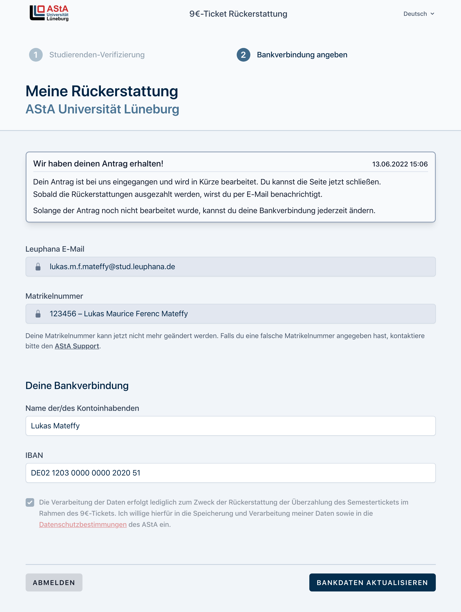
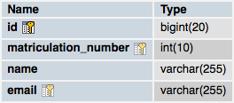

# AStA 9€-Ticket Rückerstattungs-Software

Software des AStA der Universität Lüneburg, um Anträge auf Semesterticket-Rückerstattungen wegen des 9€-Tickets anzunehmen und zu verwalten.



<br />

-   [Features](#features)
-   [Installation](#installation)
-   [Anpassung an deine Universität](#anpassung-an-deine-universität)

<br />

## Features

### Studierenden-Validierung via Uni-Email

-   Studierende an der Leuphana haben alle eine E-Mail Adresse, die mit `@stud.leuphana.de` endet.
-   Um Studierende zu verifizieren, wird eine E-Mail an diese Adresse geschickt, die einen MagicLink enthält.
-   Mit diesem Link kann sich in das System angemeldet werden. Jede/r Studierende/r kann sich damit klar identifizieren, ohne das Passwörter gespeichert werden müssen.

**Damit wird ausgeschlossen, dass Studierende mehrere Anträge abgeben.**

<br>

### Automatische Überprüfung der Matrikelnummer auf Antrags-Berechtigung

-   Im Antrag mussder Name und die IBAN angegeben werden.
-   Die Matrikelnummer wird dem Studierenden zur Bestätigung angezeigt
-   Name und IBAN können auch nach der Einreichung solange geändert werden, bis die Anträge vom Administrator exportiert wurden

**Die eingegebene Matrikelnummer wird aus dem Datensatz der berechtigten Studierenden übernommen, damit sichergestellt wird, dass der Antrag auch berechtigt ist.**

<br>

### Leicht auf Shared-Webspaces zu installieren

-   Die Software ist mit PHP und MySQL aufgebaut
-   Dadurch ist einfache Datenbankeinrichtung via phpMyAdmin möglich (je nach Webhost)
-   Nutzt das [Laravel Framework](https://laravel.com), ist damit leicht modifizierbar

### Weitere Features

-   Bankdaten können im Admin Interface als JSON oder CSV exportiert werden
-   Software ist sowohl auf Deutsch, als auch auf Englisch verfügbar

<br /><br /><br />

## Installation

### Requirements

-   PHP >= 8
-   MySQL-Datenbank
-   Webspace mit SSH-Zugang und [Composer](https://getcomposer.org) installiert

### Software laden

Melde dich über SSH auf deinem Webspace an und navigiere zu dem Ordner, in dem die Software liegen soll.
Du kannst sie dann mit `git clone` herunterladen.

```bash
git clone https://github.com/asta-luneburg/asta-ticket-refund

cd asta-ticket-refund
# Du bist jetzt im Ordner der Installation
```

### Software konfigurieren

Du muss nun ein paar Variablen konfigurieren, damit die Software richtig laufen kann.
Erstelle eine neue Datei (entweder über FTP oder via SSH z.B. `nano .env`) und füge folgenden Inhalt hinein:

```env
# Laravel Einstellungen
APP_ENV=production
APP_KEY=
APP_DEBUG=false

# Software Optionen
APP_NAME="AStA Rückerstattung"
APP_URL=https://asta-ticket-refund.test
ADMIN_EMAIL="admin@students.example.com"
ASTA_NAME="AStA Universität Musterstadt"
UNIVERSITY_NAME="Beispiel Universität"
UNIVERSITY_NAME_FULL="Beispiel Universität Musterstadt"
SUPPORT_MAIL="support@example.com"

# Footer
HOMEPAGE_URL="https://example.com/"
PRIVACY_URL="https://example.com/datenschutzerklaerung/"
IMPRESSUM_URL="https://example.com/impressum/"
FAQ_URL="https://example.com/faq/"
FOOTER_ADDRESS="<strong>Allgemeiner Student*innenausschuss</strong><br>Gebäude A1.001<br>Musterstraße 12345<br>Musterstadt"

# Email-Verifizierung
MAIL_ENDING="@students.example.com"
EXAMPLE_MAIL="max.muster@students.example.com"

# E-Mail Versand
MAIL_MAILER=smtp
MAIL_HOST=smtp.example.com
# MAIL_PORT=1025
MAIL_USERNAME=username
MAIL_PASSWORD=password
MAIL_FROM_ADDRESS="{SUPPORT_MAIL}"
MAIL_FROM_NAME="{ASTA_NAME}"

# Datenbank Optionen
DB_CONNECTION=mysql
DB_HOST=127.0.0.1
DB_PORT=8889
DB_DATABASE=asta-ticket-refunds
DB_USERNAME=root
DB_PASSWORD=root
```

Ersetze die Variablen mit Werten, die für deine Universität sinn machen.

E-Mail Versand und die Datenbank müssen konfiguriert werden, bevor die Software richtig funktionieren kann. Du musst also die `DB_` und `MAIL_` Variablen überprüfen. Richte dich hier nach der [Laravel Dokumentation](https://laravel.com/docs/9.x/installation).

### Software vorbereiten

Wenn Datenbank und co. richtig konfiguriert sind, müssen erforderliche Tabellen erstellt werden.

Dafür müssen im Ordner der Software (`asta-ticket-refund/`) folgende Kommandos ausgeführt werden:

```bash
# Dependencies installieren
composer install

# Laravel vorbereiten
php artisan key:generate
php artisan migrate
```

Die Tabellen werden nun erstellt, und die Software ist konfiguriert.

### Berechtigte Studenten hinzufügen

Verbinde dich nun manuell mit der MySQL-Datenbank. Das geht am besten mit einem Tool wie phpMyAdmin. Dies ist bei vielen Webhostern bereits vorinstalliert.

Navigiere dort in deine Datenbank und wähle die Tabelle `users` aus. Du kannst über den `Import`-Reiter Daten aus verschiedenen Formaten importieren (z.B. XLSX, SQL, ODS oder CSV), allerdings müssen diese in folgendem Spalten-Format sein:



### Fertig

Die Software ist nun fertig installiert und konfiguriert.

<br />

**Um sie aus dem Internet erreichbar zu machen, musst du deine Domain auf den `public/`-Ordner richten. Siehe [Laravel Deployment](https://laravel.com/docs/9.x/deployment).**

<br /><br /><br />

## Anpassung an deine Universität

Die Software kann an deine Universität angepasst werden.

### Allgemeine Anpassungen

In der `.env`-Datei kannst du mit den Variablen `ASTA_NAME`, `UNIVERSITY_NAME` etc. eine Personalisierung auf deine Universität festlegen.

Außerdem sind folgende Anpassungen einfach machbar:

#### Logo

Du kannst ein Logo als SVG oder JPEG/PNG einbinden, indem du sie in folgenden Dateien hinterlegst:

-   `resources/views/components/application-logo-colored.blade.php`
-   `resources/views/components/application-logo.blade.php`

#### Texte & Übersetzungen

Falls du die Texte ändern willst, kannst du das in den Views und den Übersetzungen tun.

-   `lang/de` und `lang/en`
-   `resources/views`

### Erweiterte Anpassungen

Detailliertere Anpassungen können mithilfe des Codes entwickelt werden.

Die Software ist auf Laravel aufgebaut und nutzt dessen best-practices. Daher kannst du in der [Laravel Dokumentation](https://laravel.com) herausfinden, wie man damit arbeitet.

<br /><br /><br />

## Admin/Export Interface

Du kannst die Admin-UI über diese URL erreichen: `9-euro.example.com/admin`

Du kannst eine valide Admin-Email mithilfe der `ADMIN_EMAIL` Variable festlegen.

Du musst dich vorher über die Studierenden-Verifizierung mit dieser Mail angemeldet haben, daher funktionieren nur E-Mails die auch in den berechtigten Nutzern ist.
